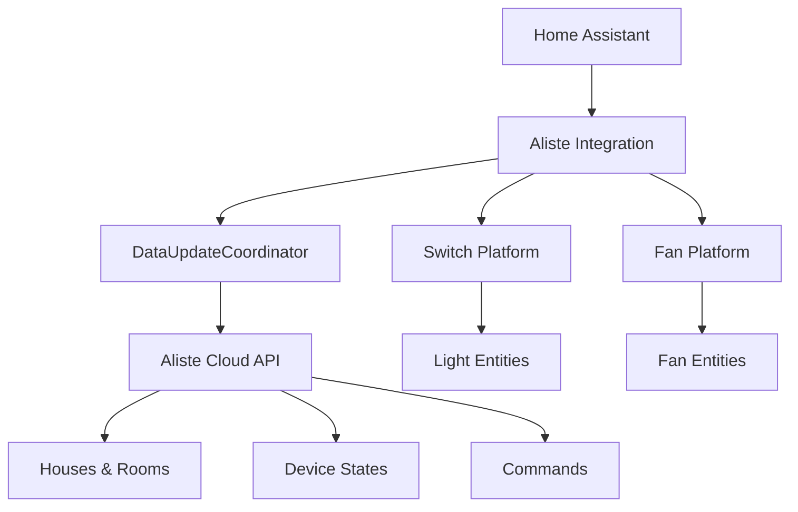

# 🏠 Aliste Home Assistant Integration

<div align="center">


[](https://github.com/MuditBansal/aliste-ha-integration/releases)
[](LICENSE)
[](https://github.com/hacs/integration)
[](https://www.home-assistant.io/)

**Transform your Aliste Technologies smart devices into a seamless Home Assistant experience**

*Control lights, fans, and appliances with professional-grade automation*

[Installation](#-installation) • [Configuration](#-configuration) • [Features](#-features) • [Support](#-support)

</div>

---

## ✨ **Key Features**

<table>
<tr>
<td width="50%">

### 🎛️ **Smart Device Control**
- **Lights & Switches**: Instant on/off control with real-time status
- **Smart Fans**: Variable speed control with discrete steps (0-100%)
- **Multi-Room Support**: Organize devices by rooms automatically

### 🔄 **Real-Time Synchronization**
- **Live State Updates**: 60-second refresh cycles keep everything in sync
- **Auto-Discovery**: New devices appear automatically
- **Instant Feedback**: No lag between action and response

</td>
<td width="50%">

### 🔧 **Professional Integration**
- **Native HA Experience**: Looks and feels like built-in components
- **Dashboard Ready**: Works with all Home Assistant dashboards
- **Automation Friendly**: Full support for scenes, automations, and scripts

### 🔐 **Enterprise Features**
- **Dynamic Credentials**: Update API credentials without reinstalling
- **Secure Authentication**: Basic Auth with encrypted storage
- **Error Handling**: Robust error recovery and logging

</td>
</tr>
</table>

---

## 🎯 **Perfect For**

<div align="center">

| 🏡 **Homeowners** | 🏢 **Property Managers** | 👨‍💻 **Home Automation Enthusiasts** |
|:---:|:---:|:---:|
| Centralized smart home control | Multi-property management | Advanced automation scenarios |
| Energy monitoring & optimization | Tenant-friendly interfaces | Integration with other smart devices |
| Voice control via Alexa/Google | Remote monitoring capabilities | Custom dashboards & analytics |

</div>

---

## 📋 **Requirements**

- **Home Assistant** 2023.1+ (Core, Supervised, or Container)
- **Aliste Technologies Account** with API access
- **HACS** (recommended) or manual installation capability

---

## 🚀 **Installation**

### Method 1: HACS (Recommended)

<details>
<summary><b>📦 Install via HACS</b></summary>

1. **Open HACS** in your Home Assistant instance
2. **Navigate** to `Integrations` → `⋮` → `Custom repositories`
3. **Add Repository**:
   ```
   Repository: https://github.com/MuditBansal/aliste-ha-integration
   Category: Integration
   ```
4. **Search** for "Aliste Home Automation" and install
5. **Restart** Home Assistant

</details>

### Method 2: Manual Installation

<details>
<summary><b>📁 Manual Installation Steps</b></summary>

1. **Download** the latest release from [GitHub Releases](https://github.com/MuditBansal/aliste-ha-integration/releases)
2. **Extract** the `aliste` folder to:
   ```
   config/custom_components/aliste/
   ```
3. **Verify** your directory structure:
   ```
   config/
   └── custom_components/
       └── aliste/
           ├── __init__.py
           ├── manifest.json
           ├── config_flow.py
           ├── switch.py
           ├── fan.py
           └── ...
   ```
4. **Restart** Home Assistant

</details>

---

## ⚙️ **Configuration**

### Initial Setup

1. **Navigate** to `Settings` → `Devices & Services` → `Add Integration`
2. **Search** for "Aliste Home Automation"
3. **Enter Credentials**:
   - **Username**: Your Aliste API username
   - **Password**: Your Aliste API password
4. **Submit** and wait for auto-discovery

### Update Credentials (Anytime)

1. **Go to** `Settings` → `Devices & Services`
2. **Find** "Aliste Home Automation" integration
3. **Click** `Configure` button
4. **Update** username/password as needed

---

## 🎮 **Usage Examples**

### Basic Device Control
```yaml
# Turn on living room lights
service: switch.turn_on
target:
  entity_id: switch.living_room_main_light

# Set bedroom fan to medium speed
service: fan.set_percentage
target:
  entity_id: fan.bedroom_fan
data:
  percentage: 50
```

### Automation Example
```yaml
# Good morning scene
automation:
  - alias: "Good Morning"
    trigger:
      platform: time
      at: "07:00:00"
    action:
      - service: switch.turn_on
        target:
          entity_id: 
            - switch.kitchen_lights
            - switch.living_room_lights
      - service: fan.turn_on
        target:
          entity_id: fan.bedroom_fan
        data:
          percentage: 25
```

---

## 🏗️ **Architecture**

<div align="center">



</div>

---

## 🔧 **Advanced Features**

### Device Mapping
The integration automatically maps Aliste device types:

| Aliste Type | HA Entity | Features |
|:---:|:---:|:---|
| `applianceType: 6` | Switch | On/Off, State Tracking |
| `applianceType: 12` | Switch | On/Off, State Tracking |
| `applianceType: 20` | Fan | Speed Control (0-100%), On/Off |

### State Management
- **Real-time Updates**: 60-second polling cycle
- **Instant Feedback**: Local state tracking prevents UI lag
- **Auto-Recovery**: Handles network interruptions gracefully

---

## 📊 **Dashboard Integration**

<details>
<summary><b>🎨 Lovelace Card Examples</b></summary>

### Light Control Card
```yaml
type: entities
title: Living Room Controls
entities:
  - entity: switch.living_room_main_light
    name: Main Light
  - entity: switch.living_room_accent_lights
    name: Accent Lights
```

### Fan Control Card
```yaml
type: thermostat
entity: fan.bedroom_fan
name: Bedroom Fan
```

### Room Overview
```yaml
type: grid
cards:
  - type: light
    entity: switch.kitchen_lights
  - type: fan
    entity: fan.kitchen_exhaust
  - type: switch
    entity: switch.kitchen_appliances
```

</details>

---

## 🐛 **Troubleshooting**

<details>
<summary><b>🔍 Common Issues & Solutions</b></summary>

### Integration Not Appearing
- ✅ Verify Home Assistant restart after installation
- ✅ Check `custom_components/aliste/` folder structure
- ✅ Review Home Assistant logs for errors

### Devices Not Discovered
- ✅ Validate API credentials in Aliste account
- ✅ Ensure devices are online in Aliste app
- ✅ Check network connectivity to Aliste cloud

### State Synchronization Issues
- ✅ Wait 60 seconds for next update cycle
- ✅ Restart the integration via HA interface
- ✅ Check API rate limits with Aliste support

### Authentication Errors
- ✅ Update credentials via integration options
- ✅ Verify username/password in Aliste app
- ✅ Contact Aliste support for API access issues

</details>

---

## 🤝 **Contributing**

We welcome contributions! Please see our [Contributing Guide](CONTRIBUTING.md) for details.

### Development Setup
```bash
# Clone repository
git clone https://github.com/MuditBansal/aliste-ha-integration.git

# Set up development environment
cd aliste-ha-integration
pip install -r requirements_dev.txt

# Run tests
pytest tests/
```

---

## 📞 **Support**

<div align="center">

| 📋 **Documentation** | 🐛 **Bug Reports** | 💡 **Feature Requests** | 💬 **Community** |
|:---:|:---:|:---:|:---:|
| [Wiki](https://github.com/MuditBansal/aliste-ha-integration/wiki) | [Issues](https://github.com/MuditBansal/aliste-ha-integration/issues) | [Discussions](https://github.com/MuditBansal/aliste-ha-integration/discussions) | [Discord](#) |

</div>

---

## 📜 **License**

This project is licensed under the **MIT License** - see the [LICENSE](LICENSE) file for details.

---

## ⭐ **Show Your Support**

If this integration has made your smart home experience better, please:

- ⭐ **Star** this repository
- 🍴 **Fork** and contribute
- 📢 **Share** with the Home Assistant community
- ☕ **[Buy me a coffee](https://www.buymeacoffee.com/muditbansal)** to support development

---

<div align="center">

**Built with ❤️ for the Home Assistant Community**

*Made by [Mudit Bansal](https://github.com/MuditBansal) • Follow [@MuditBansal](https://github.com/MuditBansal) for updates*

---

<sub>**Disclaimer**: This is a community-driven integration and is not officially endorsed by Aliste Technologies or Home Assistant. Use at your own discretion.</sub>

</div>